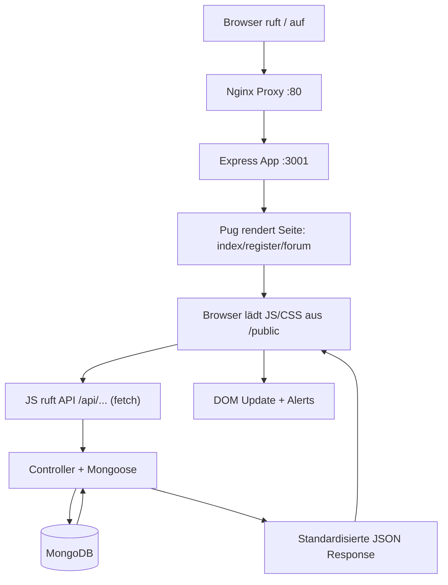

# Technische Dokumentation (Fließtext, chronologisch)

## Inhaltsangabe

1. _Projektziel und Rahmen
2. Architektur und Komponenten (Docker, Nginx, App, MongoDB)
3. Basis-Backend: Node.js und Express
4. Persistenzschicht: MongoDB und Mongoose
5. API-Kontrakte: Standardisierte Responses und Fehlerbehandlung
6. Sicherheit: Middleware-Stack (Headers, CORS, HPP, Timeouts, Rate Limits)
7. Sitzungen und Authentifizierung: Sessions + JWT (Access/Refresh)
8. Templates: Pug-Seiten (statisch gerendert)
9. Frontend-Anbindung: Fetch, DRY-Unwrap, Alerts
10. Forum-Funktionalität: Topics, Filter/Suche, Pagination
11. Forum-Funktionalität: Autoren, Löschen, Kommentare (embedded)
12. Tests: Mocha/Chai/Supertest und Docker-Testlauf
13. Seeds: Vorbefüllung der Datenbank mit Beispiel-Usern und Topics
14. Installationsanleitung
15. Programmablauf (Flowchart)
16. Glossar (Stichworte)
17. Literatur- und Hilfsmittelverzeichnis_

---

## 1. Projektziel und Rahmen

Dieses Projekt ist ein lokal laufendes Kursforum. Nutzerinnen und Nutzer können sich registrieren, sich anmelden und anschließend Beiträge (Topics) in Kurskategorien erstellen und lesen. Zusätzlich können Beiträge kommentiert werden. Die Daten werden in einer MongoDB gespeichert. Die Webseiten selbst sind bewusst weitgehend statisch; dynamische Inhalte wie Topics und Kommentare werden über eine JSON-API nachgeladen.

Die Aufgabenstellung schreibt als Kerntechnologien Node.js, Express und NGINX vor. Alles darüber hinaus (z. B. MongoDB/Mongoose, Sessions/Token, Security Middleware, Test-Stack) wird im Folgenden jeweils zweigeteilt dokumentiert: Erstens, was die Technologie grundsätzlich ist. Zweitens, warum sie in genau diesem Projekt sinnvoll bzw. notwendig ist.

---

## 2. Architektur und Komponenten (Docker, Nginx, App, MongoDB)

Die Anwendung ist als kleines, containerisiertes System aufgebaut. Die Grundlage ist `docker-compose.yml` mit drei Services: `mongodb` (Datenbank), `app` (Node/Express-Backend auf Port 3001) und `nginx` (Reverse Proxy auf Port 80). Docker sorgt dafür, dass alle Beteiligten die gleiche Laufzeitumgebung haben und die Anwendung reproduzierbar startet.

Nginx ist ein Webserver und Reverse Proxy. Ein Reverse Proxy nimmt HTTP-Anfragen entgegen und leitet sie intern an andere Dienste weiter. In diesem Projekt empfängt Nginx die Anfragen auf Port 80 und leitet sie an die Express-App weiter (`proxy_pass http://app_server`). Das ist nützlich, weil der Browser nur eine Adresse (`http://localhost`) braucht, während die internen Services getrennt bleiben.

Ein Detail, das für Stabilität wichtig ist, sind Healthchecks. In der Compose-Datei wartet die App erst auf eine „healthy“ MongoDB. Nginx wiederum hängt vom „healthy“ Zustand der App ab. Damit startet der Proxy nicht „zu früh“, wenn das Backend noch nicht bereit ist.

---

## 3. Basis-Backend: Node.js und Express

Node.js ist eine JavaScript-Laufzeitumgebung auf dem Server. Sie ermöglicht es, JavaScript außerhalb des Browsers auszuführen. Dadurch kann ein Webserver komplett in JavaScript implementiert werden.

Express ist ein Webframework für Node.js. Es stellt Routing (z. B. `GET /api/topics`) und Middleware (z. B. Body-Parsing, Security-Header) bereit. In diesem Projekt ist Express die zentrale Schicht, die HTTP-Anfragen annimmt, validiert, an Controller weitergibt und Antworten als HTML (Pug) oder JSON (API) zurücksendet.

Der Einstiegspunkt ist `server.js`. Dort wird die View-Engine gesetzt, die Middleware in einer festen Reihenfolge registriert, die MongoDB-Verbindung aufgebaut und anschließend die Routen aktiviert. Die globale Fehlerbehandlung ist am Ende des Middleware-Stacks platziert, damit alle Throw/Reject-Fälle in ein einheitliches JSON-Format übersetzt werden.

---

## 4. Persistenzschicht: MongoDB und Mongoose

MongoDB ist eine dokumentenorientierte NoSQL-Datenbank. Daten werden als Dokumente (ähnlich JSON) in Collections gespeichert. Das passt gut zu Webanwendungen, weil sich Datenstrukturen ohne starres relationales Schema abbilden lassen.

Mongoose ist eine ODM-Bibliothek (Object Document Mapper) für MongoDB in Node.js. Sie bietet Schemas, Validierung und eine komfortable Abfragesprache. In diesem Projekt werden damit zwei zentrale Modelle definiert:

- `User` (`models/User.js`) speichert Vorname, Nachname, Benutzername, Passwort (gehasht) und Kurs. Zusätzlich gibt es Sicherheitsfelder für Login-Lockout.
- `Topic` (`models/Topic.js`) speichert Titel, Inhalt, Kurs, den Autor als Referenz auf `User` und eine eingebettete Liste von Kommentaren.

Die Referenzen werden bei Leseabfragen mit `populate` aufgelöst (`controllers/topicController.js`), damit das Frontend direkt den `username` des Autors anzeigen kann. Für reine Leseperformance wird außerdem `lean()` genutzt, damit Mongoose Plain Objects statt vollwertiger Dokumentinstanzen liefert.

---

## 5. API-Kontrakte: Standardisierte Responses und Fehlerbehandlung

Eine typische Schwachstelle in Projekten ist ein inkonsistentes Response-Format: Mal kommt `{token: ...}`, mal `{data: ...}`, mal nur ein String. Das führt im Frontend schnell zu „Rateversuchen“. Um das zu vermeiden, gibt es in `utils/responseHandler.js` zentrale Helper.

`successResponse(...)` verpackt alle erfolgreichen Antworten in eine einheitliche Form mit `success`, `message` und `data`. Für Listen-Endpunkte gibt es `paginatedResponse(...)`, das zusätzlich ein `pagination`-Objekt mit Seiteninformationen zurückgibt. Dadurch muss das Frontend nicht raten, wo die Nutzdaten liegen.

Ein kurzer Auszug zeigt das Response-Format (gekürzt):

```js
// utils/responseHandler.js
const successResponse = (data, message = 'Erfolg', statusCode = 200) => {
  return {
    success: true,
    statusCode,
    message,
    data,
    timestamp: new Date().toISOString()
  };
};
```

Die Fehlerbehandlung ist zentral in `middleware/errorMiddleware.js`. Sie nimmt beliebige Errors (Custom Errors, Mongoose Errors, Token Errors) entgegen, klassifiziert sie (z. B. 400/401/404/409/500), loggt sie mit Kontext (Request-ID, Route, IP, optional User) und liefert eine sichere JSON-Antwort.

Ein besonders wichtiger Teil ist das kontrollierte „Mapping“ typischer Fehlerarten, damit Clients konsistente Statuscodes bekommen. Beispielhaft (gekürzt):

```js
// middleware/errorMiddleware.js
if (err.name === 'CastError') {
  error = new NotFoundError('Ressource nicht gefunden', 'ObjectId');
}

if (err.code === 11000) {
  const field = Object.keys(err.keyValue)[0];
  error = new ConflictError(`${field} bereits in Verwendung`, field);
}
```

Wichtig dabei ist das Projektziel „lokal, nutzerfreundlich, aber sicher“. Daher werden in `errorResponse(...)` Details nur im Development-Modus ausgegeben. So lässt sich lokal gut debuggen, ohne dass man in einer Produktionsumgebung interne Details leakt.

---

## 6. Sicherheit: Middleware-Stack (Headers, CORS, HPP, Timeouts, Rate Limits)

Sicherheit in Webanwendungen ist selten „ein Feature“, sondern ein Bündel aus kleinen, risko-reduzierenden Maßnahmen. Dieses Projekt setzt dafür mehrere etablierte Middleware-Bausteine ein.

Helmet (`helmet`) setzt Standard-Security-Header, etwa zum Schutz vor Clickjacking oder unsicheren Browser-Defaults. In `utils/securityConfig.js` wird Helmet konfiguriert. Der Code unterscheidet bewusst zwischen Development und Production, z. B. beim Thema HSTS und `upgrade-insecure-requests`, damit lokale HTTP-Setups nicht durch Browser-Caches blockiert werden.

CORS (`cors`) regelt, welche Origins Requests an die API stellen dürfen. Im Development ist `origin:true` gesetzt, um lokale Entwicklung zu vereinfachen. In Production ist die Liste über `ALLOWED_ORIGINS` einschränkbar.

HPP (`hpp`) schützt vor HTTP Parameter Pollution. Dabei senden Angreifer Parameter mehrfach, um Validierungen oder Query-Logik auszutricksen. Durch HPP wird kontrolliert, welche Parameter mehrfach erlaubt sind.

Ein Request Timeout (`requestTimeout`) begrenzt die maximale Request-Dauer. Das ist ein Schutz gegen sehr langsame Clients (Slowloris). Zusätzlich begrenzt Express den JSON Body auf 10kb. Damit sind einfache DoS-Muster (riesige JSON-Payloads) weniger effektiv.

Rate Limiting (`express-rate-limit`) schützt vor Brute Force und übermäßigen Requests. Es gibt in `middleware/rateLimitMiddleware.js` unterschiedliche Limiter für allgemeine API-Endpunkte und Auth-Endpunkte. Für Tests wurde eine deterministische Bypass-Strategie implementiert: In `NODE_ENV=test` oder bei `X-Test-Run: 1` wird nicht limitiert.

Weitere Security-Bausteine:

- `bcryptjs` dient zum Hashen von Passwörtern. Ein Hash ist eine Einwegfunktion; selbst bei Datenbank-Leaks werden Passwörter nicht im Klartext bekannt.
- `hpp`, `helmet`, `cors` und die Payload-Limits wirken zusammen als „Baseline“ gegen häufige Webrisiken.
- `uuid` wird für Request-IDs genutzt, damit Logs eindeutig korreliert werden können.

Hinweis zur Dependency `mongo-sanitize`: Sie ist in `package.json` vorhanden, wird laut `server.js` aber nicht verwendet („removed“). Das ist kein Problem für die Laufzeit, aber es ist eine technische Altlast, die man in einem Cleanup separat bewerten könnte.

---

## 7. Sitzungen und Authentifizierung: Sessions + JWT (Access/Refresh)

Authentifizierung beantwortet die Frage, ob eine Anfrage zu einem angemeldeten Benutzer gehört. Dieses Projekt nutzt JWTs (JSON Web Tokens) für API-Requests und außerdem serverseitige Sessions über `express-session`.

`express-session` ist eine Middleware, die Sitzungsdaten serverseitig verwaltet und dem Client eine Session-ID (Cookie) zuordnet. `connect-mongo` speichert diese Sessions persistent in MongoDB. Dadurch überleben Sessions Server-Restarts.

JWT (`jsonwebtoken`) ist ein signiertes Token-Format. Das Backend erstellt ein Token-Paar: Access Token (kurzlebig, für Requests) und Refresh Token (länger gültig, um neue Access Tokens zu erhalten). Die Token-Logik ist in `utils/sessionUtils.js` und `utils/tokenUtils.js` gebaut.

Der Schutz von API-Endpunkten passiert serverseitig über das `protect`-Middleware-Pattern. Ein gekürzter Ausschnitt zeigt die Erwartung an den `Authorization`-Header und das Anreichern von `req.user`:

```js
// middleware/authMiddleware.js
if (req.headers.authorization && req.headers.authorization.startsWith('Bearer ')) {
  token = req.headers.authorization.split(' ')[1];
}

const decoded = verifyAccessToken(token);
req.user = { id: decoded.id, username: decoded.username, sessionId: decoded.sessionId };
```

Wichtig für die Dokumentation: Im aktuellen Frontend werden Access Token und User via `localStorage` gespeichert (`public/utils.js`, `saveAuthData(...)`). Der Refresh Token wird ebenfalls im `localStorage` abgelegt (`public/app.js`). Das ist lokal praktikabel, aber sicherheitstechnisch ist ein HttpOnly-Cookie-Ansatz in produktiven Setups üblicher. Da dieses Projekt lokal ausgelegt ist, wurde pragmatisch `localStorage` verwendet.

---

## 8. Templates: Pug-Seiten (statisch gerendert)

Pug ist eine Template-Engine für Node.js. Sie generiert HTML aus einer kompakteren, eingerückten Syntax. Der Vorteil ist eine bessere Lesbarkeit für statische Layouts und eine saubere Wiederverwendung über `extends`/`block`.

In `server.js` ist Pug als View Engine aktiv. `routes/pageRoutes.js` rendert drei Seiten: `/` (Startseite), `/register` (Registrierung) und `/forum` (Forum). Diese Seiten sind bewusst statisch; dynamische Inhalte werden im Browser via Fetch geladen.

Pug-Auszug aus dem Layout (Kurzbeispiel, weil es das zentrale Template-Pattern zeigt):

```pug
extends layout

block head
  link(rel="stylesheet", href="/homepage.css")
  script(src="/homepage.js", defer)

block content
  header.header
    // ...
```

---

## 9. Frontend-Anbindung: Fetch, DRY-Unwrap, Alerts

Das Frontend ist in Vanilla JavaScript umgesetzt. Die Kommunikation läuft über `fetch` und eine kleine, zentrale Helper-Schicht in `public/utils.js`.

Damit das Frontend nicht überall Response-Strukturen „kennt“, gibt es `unwrapApiResponse(...)`. Diese Funktion extrahiert `data` aus dem standardisierten Backend-Format. Zusammen mit `buildUserAlertMessage(...)` werden Fehlermeldungen nutzerfreundlich, weil Validation-Details als Liste angezeigt werden, statt nur „Validierungsfehler“.

Ein Auszug aus `buildUserAlertMessage(...)` zeigt, wie aus `message` und `details` ein Text für `alert(...)` entsteht:

```js
// public/utils.js
const details = Array.isArray(body.details) ? body.details : [];
if (!details.length) return base;

const lines = details
  .map(d => `• ${d.field}: ${d.message}`)
  .join('\n');

return `${base}\n${lines}`;
```

---

## 10. Forum-Funktionalität: Topics, Filter/Suche, Pagination

Die Topics-API liegt unter `/api/topics` (siehe `routes/topicRoutes.js` und `controllers/topicController.js`). Der GET-Endpunkt unterstützt Filter nach Kurs und Pagination über `page` und `limit`. Die Antwort enthält die Topics und ein `pagination`-Objekt.

Die Pagination ist serverseitig bewusst defensiv umgesetzt: Page wird mindestens 1, Limit wird begrenzt (max. 100), und `skip` wird daraus berechnet. Das verhindert sowohl negative Werte als auch extrem große Antworten.

```js
// controllers/topicController.js
const pageNum = Math.max(1, parseInt(page) || 1);
const limitNum = Math.min(100, Math.max(1, parseInt(limit) || 10));
const skip = (pageNum - 1) * limitNum;
```

Im Frontend (`public/forumpage.js`) werden Topics nachgeladen, im DOM gerendert und clientseitig per Suche gefiltert. Für große Listen gibt es „Mehr laden“: Das Frontend lädt seitenweise nach und hängt die neuen Topics an, ohne Duplikate zu erzeugen.

---

## 11. Forum-Funktionalität: Autoren, Löschen, Kommentare (embedded)

Damit Topics den Autor anzeigen können, speichert das Topic-Modell eine Referenz auf den `User`. In `getTopics` wird diese Referenz via `.populate('author', 'username')` aufgelöst. Im UI wird dann `@username` angezeigt.

Das Löschen eines Topics ist serverseitig geschützt: Der DELETE-Endpunkt ist mit `protect` abgesichert und prüft im Controller, ob der eingeloggte User der Autor ist. Im Frontend wird der „Löschen“-Button zusätzlich nur angezeigt, wenn `user.username` mit dem Topic-Autor übereinstimmt.

Kommentare sind als „embedded comments MVP“ umgesetzt. Das heißt: Kommentare liegen direkt im Topic-Dokument (`Topic.comments[]`). `POST /api/topics/:id/comments` fügt einen Kommentar hinzu. Beim Laden werden `comments.author` ebenfalls populiert, damit die UI den Kommentarautor anzeigen kann.

Im UI ist die Kommentarsektion bewusst zurückhaltend: Standardmäßig wird nur der neueste Kommentar gezeigt. Über einen Toggle können ältere Kommentare ein- und ausgeblendet werden. Das Textfeld zum Schreiben erscheint erst nach Klick auf „Kommentieren…“ und verschwindet nach erfolgreichem Senden wieder.

---

## 12. Tests: Mocha/Chai/Supertest und Docker-Testlauf

Mocha (`mocha`) ist ein Test Runner, Chai (`chai`) ist eine Assertion Library, und Supertest (`supertest`) erlaubt HTTP-Tests gegen die API. Die Tests liegen unter `tests/` und prüfen Auth, Topics und Page-Routes.

Wichtig ist die Ausführung im realistischen Setup. Deshalb existiert in `package.json` ein Docker-Testscript: `npm run test:docker` startet das Compose-Setup (inkl. Build) und führt die Tests im `app`-Container aus.

---

## 13. Seeds: Vorbefüllung der Datenbank mit Beispiel-Usern und Topics

Wir haben `seedTopics.js`, ein Skript, das die MongoDB mit Beispiel-Usern und Topics füllt. Das ist nützlich, damit man direkt nach dem Starten der Anwendung Inhalte zum Testen und Anschauen hat. 
Es werden drei User mit unterschiedlichen Kursen angelegt, sowie mehrere Topics mit verschiedenen Autoren und Kursen.

---
## 14. Installationsanleitung

Voraussetzung ist Docker Desktop. Danach kann das Projekt lokal mit Docker Compose gestartet werden. Für Abgabe und Wiederholbarkeit ist der Docker-Weg die Referenz.

```bash
# Projekt starten (Container bauen und starten)
docker compose up -d --build

# Status prüfen
docker compose ps

# Logs der App ansehen (hilft bei typischen Startproblemen)
docker compose logs --tail=200 app

# Website im Browser:
# http://localhost

# Tests im Docker-Setup ausführen
npm run test:docker
```

---

## 15. Programmablauf (Flowchart)



---

## 16. Glossar (Stichworte)

- **Access Token**: Kurzlebiges JWT für API-Requests.
- **Bearer Token**: Token-Übertragung über `Authorization: Bearer ...`.
- **bcryptjs**: Bibliothek zum Hashen und Vergleichen von Passwörtern.
- **Body**: Nutzdaten einer HTTP-Anfrage/-Antwort (z. B. JSON bei POST).
- **Bootstrap**: CSS-Framework.
- **Chai**: Assertion Library (z. B. `expect`).
- **Collection**: „Tabelle“ in MongoDB (Sammlung von Dokumenten).
- **CommonJS**: Modulsystem in Node.js (`require(...)`, `module.exports`).
- **connect-mongo**: Session-Store-Adapter, um Sessions in MongoDB zu speichern.
- **Container**: Isolierte Laufzeitumgebung für eine Anwendung.
- **Controller**: Code-Schicht, die Requests in Fachlogik übersetzt.
- **Cookie**: Kleiner Datensatz, den der Browser bei Requests mitsendet.
- **CORS**: Browser-Regelwerk, das Cross-Origin Requests kontrolliert.
- **CSP (Content Security Policy)**: Regeln, welche Skripte/Styles/Quellen erlaubt sind.
- **Credentials (CORS)**: Einstellung, ob Cookies/Authorization über Origins gesendet werden dürfen.
- **Docker**: Tool zur Containerisierung von Anwendungen.
- **Docker Compose**: Orchestrierung mehrerer Container als Einheit.
- **Document**: Ein Datensatz als JSON-ähnliches Objekt in MongoDB.
- **dotenv**: Bibliothek, die Umgebungsvariablen aus einer `.env`-Datei lädt.
- **DoS (Denial of Service)**: Angriff, der Dienste durch Überlastung unbenutzbar macht.
- **Environment Variable**: Konfigurationswert in der Prozessumgebung (z. B. Secrets, Ports).
- **Express**: Webframework für Node.js (Routing + Middleware).
- **express-rate-limit**: Bibliothek für Rate Limits in Express.
- **express-session**: Express-Middleware für Sessions.
- **express-validator**: Bibliothek zur Validierung und Sanitization von Request-Daten auf Route-Ebene.
- **fetch**: Browser-API für HTTP-Requests aus JavaScript.
- **Font Awesome**: Icon-Bibliothek (im Projekt via CDN eingebunden).
- **Hash**: Einwegfunktion; aus Hash ist Original nicht zurückrechenbar.
- **Header**: Metadaten einer HTTP-Anfrage/-Antwort (z. B. `Authorization`).
- **Healthcheck**: Prüfung, ob ein Service bereit ist (z. B. `/health`).
- **Helmet**: Express-Middleware für Security-Header.
- **HPP (HTTP Parameter Pollution)**: Angriffsmethode über doppelte Query-Parameter.
- **hpp**: Express-Middleware zum Schutz gegen HPP.
- **HSTS**: Header, der Browser zwingt, künftig nur HTTPS zu nutzen.
- **HTTP**: Protokoll für Webanfragen (Request/Response).
- **httpOnly Cookie**: Cookie, das JS nicht direkt lesen kann (XSS-Schutz).
- **Image**: „Bauplan“ für Container.
- **Index**: Datenbankstruktur, die Abfragen beschleunigt (z. B. auf `username`).
- **Integrationstest**: Test, der mehrere Komponenten gemeinsam prüft.
- **jsonwebtoken**: Bibliothek zum Signieren/Prüfen von JWTs.
- **JSON**: Textformat für strukturierte Daten (API-Payloads).
- **JWT (JSON Web Token)**: Signiertes Tokenformat zur Authentifizierung.
- **lean()**: Mongoose-Option, die Plain Objects statt Mongoose-Dokumente liefert.
- **Layout/extends**: Pug-Mechanismus zur Wiederverwendung eines Grundlayouts.
- **localStorage**: Browser-Speicher für kleine Datenmengen (hier: Tokens/Userdaten).
- **Log Level**: Einstufung von Logs (debug/info/warn/error).
- **Middleware**: Funktion, die Requests in Express schrittweise verarbeitet.
- **Model**: Mongoose-API für eine Collection (z. B. `User`, `Topic`).
- **Mocha**: JavaScript Test Runner.
- **MongoDB**: Dokumentenorientierte NoSQL-Datenbank.
- **mongo-sanitize**: Bibliothek, die MongoDB-Operatoren (z. B. `$...`) aus Eingaben entfernen kann; im Projekt als Dependency vorhanden, aber laut `server.js` derzeit nicht aktiv genutzt.
- **Mongoose**: ODM für MongoDB (Schema, Validierung, Queries).
- **Network (Docker)**: Virtuelles Netzwerk, das Container miteinander verbindet.
- **Nginx**: Webserver/Reverse Proxy.
- **Node.js**: JavaScript-Laufzeitumgebung für Serverprogramme.
- **ObjectId**: MongoDB-ID-Typ für Dokumente.
- **ODM (Object Document Mapper)**: Bibliothek, die Datenbankdokumente in Objekte abbildet.
- **Origin**: Kombination aus Schema + Host + Port (z. B. `http://localhost:80`).
- **Payload Limit**: Begrenzung der Größe einer Anfrage (hier: JSON `10kb`).
- **populate**: Mongoose-Funktion, die Referenzen (z. B. `author`) auflöst.
- **PORT**: TCP-Port, auf dem ein Dienst lauscht.
- **Pug**: Template-Engine, die HTML generiert.
- **Rate Limit**: Begrenzung der Request-Anzahl pro Zeit.
- **Refresh Token**: Langlebiges JWT, um neue Access Tokens zu erzeugen.
- **Request**: Anfrage vom Client an den Server.
- **Request ID**: ID zur Nachverfolgung eines Requests über Logs.
- **Request Timeout**: Begrenzung der maximalen Request-Dauer.
- **Response**: Antwort des Servers an den Client.
- **REST (vereinfacht)**: Stil, bei dem Ressourcen über eindeutige URLs und HTTP-Methoden angesprochen werden.
- **Reverse Proxy**: Vermittler, der externe Requests intern weiterleitet.
- **Route**: Zuordnung „Pfad + HTTP-Methode → Handler“.
- **Router**: Express-Komponente, die Routen bündelt (z. B. `routes/topicRoutes.js`).
- **Salt**: Zufallswert zur Stärkung von Passwort-Hashes.
- **sameSite Cookie**: Cookie-Regel zur CSRF-Reduktion.
- **Sanitization**: Bereinigung von Eingaben (z. B. Trimming), um Risiken zu reduzieren.
- **Schema**: Strukturdefinition für Dokumente (z. B. User/Topic).
- **Seeds**: Vorbefüllte Daten, um die Funktionalität zu demonstrieren (hier: `seedTopics.js`).
- **Secret**: Geheimer Wert (z. B. JWT-Secret), der nicht in Git gehört.
- **Security Header**: HTTP-Header, die Browser-Sicherheitsverhalten steuern.
- **Session**: Serverseitiger Zustand pro Nutzer (typisch über Cookie-ID referenziert).
- **Session Store**: Persistenter Speicher für Sessions.
- **Slowloris**: DoS-Muster durch extrem langsame Requests.
- **Static Assets**: Statische Dateien wie CSS/JS/Bilder unter `public/`.
- **Statuscode**: Zahl in HTTP-Antworten, die Erfolg/Fehler signalisiert (z. B. 200, 201, 400, 401, 404).
- **Structured Logging**: Logs mit Key-Value-Feldern (besser filterbar als reiner Text).
- **Supertest**: Bibliothek für HTTP-Tests gegen Node/Express.
- **Upstream**: Nginx-Konzept für ein Zielsystem (hier: `app:3001`).
- **uuid**: Bibliothek zur Erzeugung eindeutiger IDs (z. B. Request-IDs, Session-IDs).
- **Validierung**: Prüfung, ob Eingaben den Regeln entsprechen (Pflichtfelder, Länge, Format).
- **Volume**: Persistenter Speicher, der Container-Neustarts überlebt.
- **winston**: Logging-Bibliothek für strukturierte Logs.
