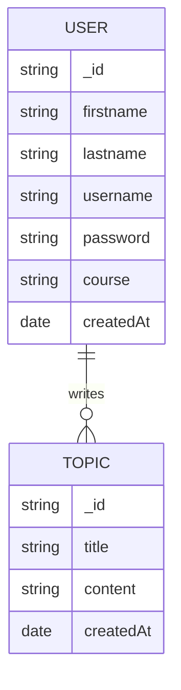
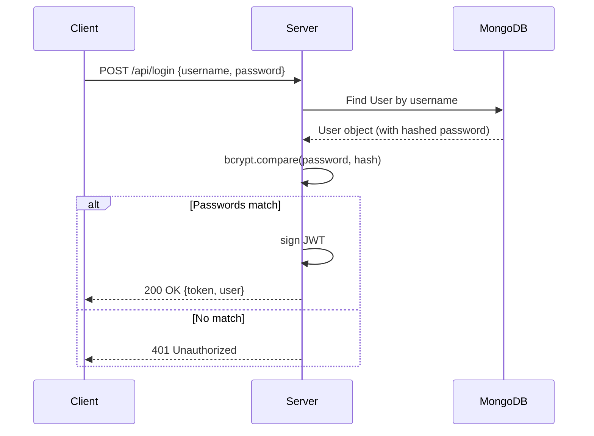

# Project Documentation

This document provides a comprehensive overview of the technical architecture, API, and setup procedures for the Web-Engineering-Semester1 project.

## 1. Core Technologies

### 1.1 Node.js
Node.js is the runtime environment that allows the application to run JavaScript on the server-side. It is built on Chrome's V8 JavaScript engine and uses an event-driven, non-blocking I/O model, making it highly efficient for handling multiple concurrent requests, which is essential for a web application.

### 1.2 Express.js
Express is a minimal and flexible Node.js web application framework. In this project, it serves as the backbone of the backend, responsible for:
- **Routing**: It maps incoming HTTP requests (like `GET /api/topics` or `POST /api/login`) to the correct logic in the code.
- **Middleware**: Express uses middleware functions to process requests before they reach the final handler. This includes `express.json()` for parsing JSON data in request bodies and `express.static()` for serving the frontend files (HTML, CSS, JS).
- **Request/Response Handling**: It simplifies the process of receiving data from the client and sending back appropriate status codes and data.

### 1.3 CORS (Cross-Origin Resource Sharing)
CORS is a security mechanism that allows or restricts resources on a web page from being requested from another domain outside the one from which the resource originated.
In this project, the `cors` package is used to manage these permissions. This is crucial because, during development or when using different services (like Nginx), the frontend and backend might technically reside on different "origins." CORS ensures that the browser allows the frontend to communicate with the backend API securely.

### 1.4 Mongoose & MongoDB
MongoDB is a NoSQL database that stores data in flexible, JSON-like documents. Mongoose is an Object Data Modeling (ODM) library that acts as a bridge between Node.js and MongoDB.
- **Schemas**: Mongoose allows us to define "Schemas," which act as templates for our data (e.g., ensuring every `User` has a `username` and `password`).
- **Models**: Once a schema is defined, Mongoose creates "Models" that provide a powerful interface for interacting with the database—allowing us to easily save, find, and update records using standard JavaScript objects.
- **Validation**: It provides built-in validation to ensure that only "clean" and correctly formatted data is saved to the database.

---

## 2. Architecture Overview

The application follows a 3-tier architecture, containerized using Docker and served through an Nginx reverse proxy. The backend has been modularized for better maintainability and security.

### 2.1 Backend Structure (Modularized)
- **`/models`**: Contains Mongoose schemas and models (User, Topic).
- **`/controllers`**: Contains the business logic for each resource (Auth, Topics).
- **`/routes`**: Defines the API endpoints and maps them to controllers.
- **`/middleware`**: Custom middleware for authentication and error handling.
- **Entry Point**: `server.js` (Initializes Express, connects to MongoDB, and registers routes).
- **Port**: 3001

### 2.2 Security Implementation
- **Password Hashing**: User passwords are never stored in plaintext. The application uses `bcryptjs` to hash passwords before they are saved to the database.
- **JWT Authentication**: Secure authentication is implemented using JSON Web Tokens (JWT). Upon successful login, the server issues a token that the client must include in the `Authorization` header for protected requests.
- **Protected Routes**: Sensitive endpoints (e.g., `POST /api/topics`) are protected by a middleware that verifies the JWT.
- **Data Validation**: Server-side validation ensures that required fields are present and unique (e.g., `username`).

### 2.3 Database Model (ERM)


### 2.4 Login Process (Sequence Diagram)


### 2.5 Frontend Structure
The frontend logic is implemented in pure (Vanilla) JavaScript, emphasizing direct DOM manipulation and the Fetch API.
- **Styling**: Uses Bootstrap 5.3 and custom CSS (`homepage.css`, `forumpage.css`) for a responsive and modern layout.
- **Communication**: All data exchange between the frontend and backend happens via asynchronous `fetch` calls to the `/api/*` endpoints.

#### Frontend Logic Details:
- **`app.js`**: 
  - Manages the authentication flow on the landing page.
  - Implements `registration()` and `login()` functions that send POST requests to the backend.
  - Handles UI feedback via alerts and redirects the user to the forum page upon successful authentication.
- **`forumpage.js`**:
  - Handles the core forum functionality.
  - **Topic Loading**: Fetches the list of topics from `/api/topics` and dynamically generates the HTML structure for each post (using `article` tags).
  - **Topic Creation**: Collects data from the input fields and sends it to the server.
  - **Navigation**: Includes logic for the "Back to top" feature and secure logout (redirecting back to the index).

### 2.3 Infrastructure (Docker & Nginx)
- **Docker**: Used to create a consistent environment across different machines. It orchestrates three containers: `mongodb` (Database), `app` (Node.js Server), and `nginx` (Proxy).
- **Nginx**: Configured as a reverse proxy on port 80. It receives all external traffic and intelligently forwards it to the Node.js application.

---

## 3. API Reference

### Health Check
- **GET** `/health`
  - Purpose: Checks if the server is running.
  - Returns: `200 OK` (plain text)

### Authentication
- **POST** `/api/registration`
  - Body: `{ firstname, lastname, username, password, course }`
  - Returns: `201 Created` with a JWT token and user info.
- **POST** `/api/login`
  - Body: `{ username, password }`
  - Returns: `200 OK` with a JWT token and user info, or `401 Unauthorized` on failure.

### Forum Topics
- **GET** `/api/topics`
  - Purpose: Fetch all topics.
  - Access: Public.
  - Returns: `200 OK` with an array of all topics, sorted by date.
- **POST** `/api/topics`
  - Purpose: Create a new topic.
  - Access: Private (requires valid JWT in `Authorization` header).
  - Body: `{ title, content }`
  - Returns: `201 Created` with the saved topic or `401 Unauthorized` if no/invalid token.

---

## 4. Installation Guide

### 4.1 Prerequisites
- **Node.js**: v18 or higher.
- **MongoDB**: Community Edition (required only for local, non-Docker runs).
- **Docker Desktop**: Recommended for the easiest setup.

### 4.2 MacOS Installation

1. **Install Homebrew**:
   ```bash
   /bin/bash -c "$(curl -fsSL https://raw.githubusercontent.com/Homebrew/install/HEAD/install.sh)"
   ```
2. **Install Node.js**:
   ```bash
   brew install node
   ```
3. **Install MongoDB**:
   ```bash
   brew tap mongodb/brew
   brew install mongodb-community@7.0
   ```
4. **Start MongoDB Service**:
   ```bash
   brew services start mongodb-community@7.0
   ```
5. **Project Setup**:
   ```bash
   git clone <repository-url>
   cd Web-Engineering-Semester1
   npm install
   ```
6. **Run Locally**:
   ```bash
   npm start
   ```

### 4.3 Windows Installation

1. **Install Node.js**:
   - Download the Windows Installer (.msi) from [nodejs.org](https://nodejs.org/).
2. **Install MongoDB**:
   - Download the MongoDB Community Server from [mongodb.com](https://www.mongodb.com/try/download/community).
   - During installation, ensure "Install MongoDB as a Service" is selected.
3. **Project Setup**:
   - Open PowerShell or Command Prompt.
   - `git clone <repository-url>`
   - `cd Web-Engineering-Semester1`
   - `npm install`
4. **Run Locally**:
   ```cmd
   npm start
   ```

### 4.4 Docker Setup (Recommended for MacOS & Windows)
1. **Install Docker Desktop** from [docker.com](https://www.docker.com/).
2. **Run the Application**:
   ```bash
   docker-compose up --build
   ```
   The application will be available at `http://localhost`.

---

## 5. Testing

The project uses **Mocha** (test runner), **Chai** (assertions), and **Supertest** (API testing).

- **Run Tests**:
  ```bash
  npm test
  ```
  *Note: If running tests locally, ensure the server is active on port 3001.*
