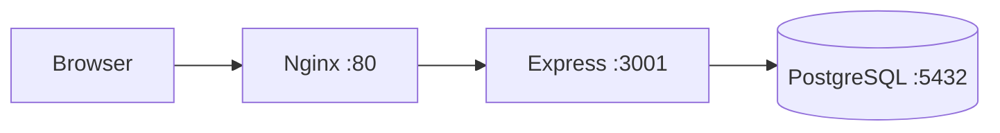

# Architecture

See also: [Database schema](../reference/database-schema.md) · [Security](security.md) · [Auth model](auth-model.md)

Kursforum is a single Express application that both renders HTML pages with Pug and serves a JSON API. It stores everything in PostgreSQL and, in the Docker setup, sits behind an Nginx reverse proxy.

## Request flow

In development without Docker, Nginx is absent and the browser talks to Express directly on port `3001`. Either way, Express is the single entry point for both pages and the API.

## Layers inside the app

A request passes through a fixed middleware chain before reaching a route, set up in `server.js`:

1. **Request ID** — tags each request for tracing in the logs.
2. **HTTPS enforcement** — redirects to HTTPS in production (when `NODE_ENV=production` and the request did not arrive over HTTPS).
3. **Security headers** — Helmet plus a few custom headers.
4. **CORS** — a development or production config depending on `NODE_ENV`.
5. **Body parsing** — JSON only, capped at `10kb`.
6. **Session** — an Express session backed by the PostgreSQL `session` table.

Routes are then mounted in order: `/api` (auth), `/api/topics` (topics and comments), `/` (Pug pages), and finally `express.static` for assets in `public/`. Anything unmatched hits a 404 handler that returns JSON for API clients and a rendered `404.pug` for browsers.

## Code layout

| Directory | Responsibility |
| --------- | -------------- |
| `routes/` | Endpoint definitions, wire middleware to controllers |
| `controllers/` | Request handling and response shaping |
| `models/` | Data access for `User` and `Topic` over the `pg` pool |
| `middleware/` | Security, sessions, rate limiting, validation, error handling |
| `utils/` | Token helpers, validation rules, response envelope, logging |
| `db/` | PostgreSQL pool (`index.js`) and schema (`schema.sql`) |
| `views/` | Pug templates |
| `public/` | Static CSS, JS and images |
| `seeds/` | Demo-topic seeding |

## Startup sequence

On boot the app reads `db/schema.sql` and runs it against PostgreSQL, creating any missing tables. Only after the schema is ready does it optionally seed demo topics and start listening. If the database connection fails, the process exits with a non-zero code rather than serving requests against a broken backend.

## Responses

Every controller returns through a shared response helper, so clients always get the same envelope: a `success` flag, `statusCode`, human-readable `message`, `data`, a `timestamp`, and a `requestId`. List endpoints add a `pagination` block. This consistency is what the [API reference](../reference/api.md) documents.
