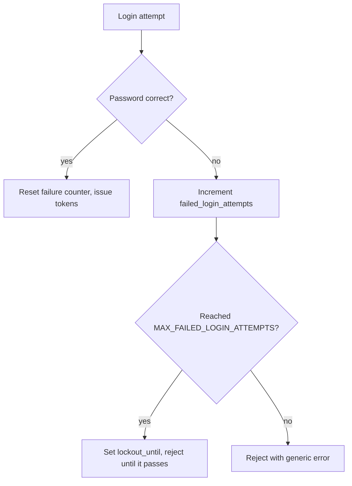

# Auth model

See also: [API reference](../reference/api.md) · [Security](security.md)

Kursforum combines stateless JWT access tokens with a server-side session and a failed-login lockout. This page explains why those pieces exist and how they interact.

## Tokens

Login and registration return a **token pair**:

- An **access token** (default lifetime `15m`) that the client sends on protected requests as `Authorization: Bearer <token>`.
- A **refresh token** (default `7d`) used only to obtain a new access token from `POST /api/refresh`.

Short-lived access tokens limit the damage if one leaks; the refresh token lets a client stay logged in without re-entering credentials. The two are signed with separate secrets (`ACCESS_TOKEN_SECRET`, `REFRESH_TOKEN_SECRET`) so a leaked access secret can't mint refresh tokens.

## Why also a session

Alongside the tokens, login stores a session in PostgreSQL (`connect-pg-simple`, the `session` table). The session holds the user id, username and a `sessionId`, and logout destroys it. The session gives the server a place to invalidate a login, something a purely stateless JWT can't do on its own.

## Protecting a route

The `protect` middleware guards every write endpoint. It expects `Authorization: Bearer <accessToken>`, verifies the signature and expiry, and attaches the decoded user to the request. Missing or invalid tokens are rejected before the controller runs, and the rejection is logged as a security event.

## Account lockout

Repeated bad passwords don't just fail, they count. The flow:

Defaults: lock after `5` failures (`MAX_FAILED_LOGIN_ATTEMPTS`), stay locked `15` minutes (`LOCKOUT_DURATION_MINUTES`), and reset the counter after `60` idle minutes (`RESET_FAILURES_AFTER_MINUTES`). A locked account is rejected even with the right password until the lock expires.

!!! note "Login errors don't reveal whether a username exists"
    An unknown username and a wrong password return the same generic authentication error, so an attacker can't probe for valid usernames. A locked account returns a distinct "account locked" message. In every case the detailed reason is written only to the server logs.
