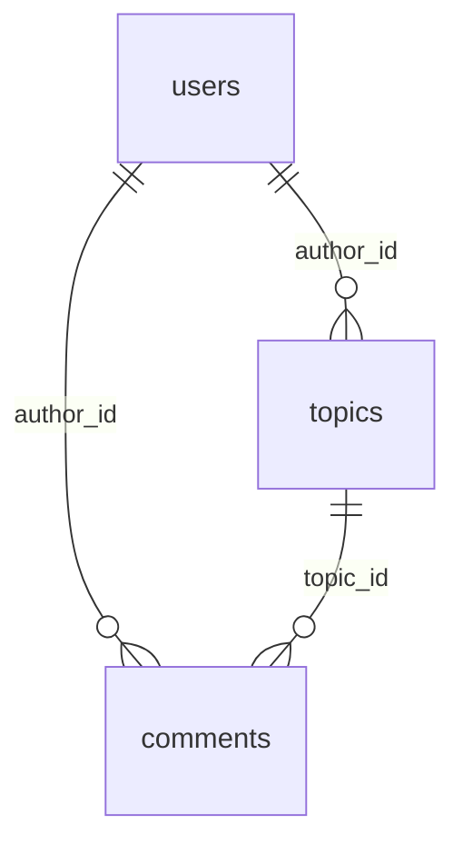

# Database schema

See also: [Architecture](../explanation/architecture.md) · [API reference](api.md)

The PostgreSQL schema in `db/schema.sql`. The app applies it on startup with `CREATE TABLE IF NOT EXISTS`, so tables are created automatically if they don't exist.

## users

Registered accounts, including login-security bookkeeping.

| Column | Type | Notes |
| ------ | ---- | ----- |
| `id` | `SERIAL` | Primary key |
| `firstname` | `VARCHAR(50)` | Not null |
| `lastname` | `VARCHAR(50)` | Not null |
| `username` | `VARCHAR(20)` | Unique, not null, stored lowercase |
| `password` | `VARCHAR(255)` | Not null, bcrypt hash |
| `course` | `VARCHAR(3)` | Not null, one of `TIA`, `TIS`, `TIK` (CHECK) |
| `failed_login_attempts` | `INTEGER` | Not null, default `0` |
| `lockout_until` | `TIMESTAMPTZ` | Set while an account is locked |
| `last_failed_login_at` | `TIMESTAMPTZ` | |
| `last_login_at` | `TIMESTAMPTZ` | |
| `created_at` | `TIMESTAMPTZ` | Not null, default `NOW()` |
| `updated_at` | `TIMESTAMPTZ` | Not null, default `NOW()` |

## topics

Forum topics, one per thread.

| Column | Type | Notes |
| ------ | ---- | ----- |
| `id` | `SERIAL` | Primary key |
| `title` | `TEXT` | Not null |
| `content` | `TEXT` | Not null |
| `kurs` | `VARCHAR(3)` | Not null, one of `TIA`, `TIS`, `TIK` (CHECK) |
| `seed_key` | `VARCHAR(100)` | Unique; identifies seeded rows |
| `seed_author_name` | `VARCHAR(50)` | Display author for seeded topics |
| `author_id` | `INTEGER` | References `users(id)`, `ON DELETE SET NULL` |
| `created_at` | `TIMESTAMPTZ` | Not null, default `NOW()` |

## comments

Comments attached to a topic.

| Column | Type | Notes |
| ------ | ---- | ----- |
| `id` | `SERIAL` | Primary key |
| `topic_id` | `INTEGER` | Not null, references `topics(id)`, `ON DELETE CASCADE` |
| `content` | `TEXT` | Not null |
| `author_id` | `INTEGER` | References `users(id)`, `ON DELETE SET NULL` |
| `seed_author_name` | `VARCHAR(50)` | Display author for seeded comments |
| `created_at` | `TIMESTAMPTZ` | Not null, default `NOW()` |

## session

Server-side session store for `connect-pg-simple`.

| Column | Type | Notes |
| ------ | ---- | ----- |
| `sid` | `varchar` | Primary key |
| `sess` | `json` | Session payload |
| `expire` | `timestamp(6)` | Not null; indexed by `IDX_session_expire` |

## Relationships

Deleting a user sets `author_id` to `NULL` on their topics and comments (the content stays). Deleting a topic cascades to its comments.
